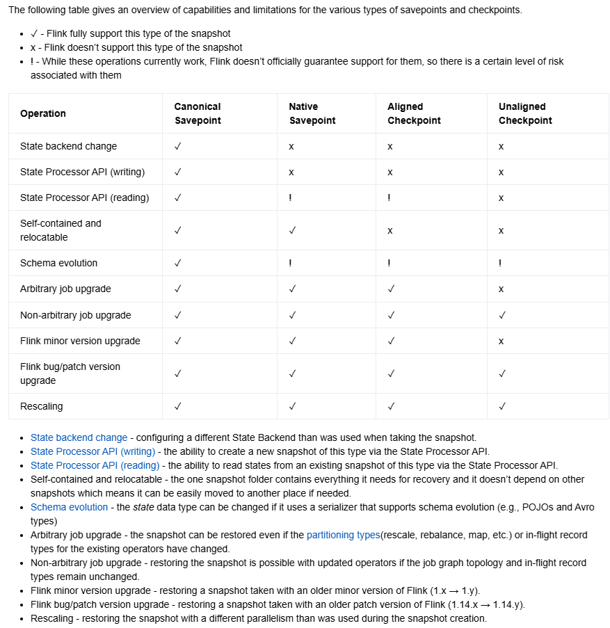

# Flink 1.13 Native格式Savepoint支持包说明

## 本工程为解决Flink1.13版本大状态任务进行Savepoint和从Savepoint启动慢的问题

### 1.基本原理

Flink1.13版本的Savepoint为了实现在不同状态后端之间的切换（EmbeddedRocksDBStateBackend、HashMapStateBackend）其Savepoint使用了统一的格式进行存储，并命名为CanonicalSavepoint。

任务进行这种类型的Savepoint时会将存储在状态后端（主要是RocksDB）中**全部**状态数据读取出来，经序列化后存储到Savepoint目录中。任务从Savepoint启动时又会将全部状态数据从Savepoint目录中读取并回写到状态后端中，这样就会造成大状态任务在进行Savepoint或是从Savepoint恢复时需要花费大量时间对状态数据进行序列化/反序列化，造成Savepoint时间长/任务启动慢。

如果使用的是RocksDB状态后端，由于其基本原理为LSM（Log-structured Merge Tree），每当有新的数据写入到RocksDB中，在刷盘后至少会生成1个新的SST文件，也就使得RocksDB后端天然地支持增量Checkpoint。在进行Checkpoint时，只需要对比前一次Checkpoint的全部SST文件，将新增的SST文件上传至Checkpoint目录中，即可完成一次增量Checkpoint。

参考Checkpoint的执行方式，在执行Savepoint时/从Savepoint恢复时，如果可以将将状态读取和序列化替换为全量的SST文件的上传/下载，就可以解决序列化/反序列化造成Savepoint时间长/任务启动慢的问题，实现任务快速Savepoint和启动（在Flink1.15及以后的版本也是将Checkpoint策略进行了类似的修改，从而实现Native格式的Savepoint）。

工程中对RocksDB状态后端增量快照相关代码做了修改，在进行Savepoint时，使用Checkpoint方式进行全量完整的快照，从而实现Native格式的Savepoint。

使用Native格式Savepoint最大的问题在于Savepoint数据与状态后端强相关，也就造成其不支持在不同状态后端之间进行切换，如果需要进行切换，则必须使用Canonical格式进行一次Savepoint后续就可以切换至其他状态后端。但实际应用中，绝大多数任务（尤其是大状态任务）基本使用的都是RocksDB状态后端，很少会进行状态后端的切换。



关于Flink1.15版本及以后的Native格式Savepoint请参阅官方文档：<https://nightlies.apache.org/flink/flink-docs-release-1.15/docs/ops/state/checkpoints_vs_savepoints/>

### 2.源码变更点

#### 2.1 [StreamOperatorStateHandler.java](src%2Fmain%2Fjava%2Forg%2Fapache%2Fflink%2Fstreaming%2Fapi%2Foperators%2FStreamOperatorStateHandler.java) 【将键控状态的Savepoint行为修改为Checkpoint方式执行】

主要变更为```174:void snapshotState(CheckpointedStreamOperator streamOperator, Optional<InternalTimeServiceManager<?>> timeServiceManager, String operatorName, long checkpointId, long timestamp, CheckpointOptions checkpointOptions, CheckpointStreamFactory factory, OperatorSnapshotFutures snapshotInProgress, StateSnapshotContextSynchronousImpl snapshotContext, boolean isUsingCustomRawKeyedState)```方法，在220行原本位置删除了对于Checkpoint类型的判断，一律按Checkpoint方式执行。

代码变更如下：
```diff
--- a/StreamOperatorStateHandler.java
+++ b/StreamOperatorStateHandler.java
@@ -30,35 +30,15 @@ import org.apache.flink.core.fs.CloseableRegistry;
 import org.apache.flink.runtime.checkpoint.CheckpointException;
 import org.apache.flink.runtime.checkpoint.CheckpointFailureReason;
 import org.apache.flink.runtime.checkpoint.CheckpointOptions;
-import org.apache.flink.runtime.state.AbstractKeyedStateBackend;
-import org.apache.flink.runtime.state.CheckpointStreamFactory;
-import org.apache.flink.runtime.state.CheckpointableKeyedStateBackend;
-import org.apache.flink.runtime.state.DefaultKeyedStateStore;
-import org.apache.flink.runtime.state.FullSnapshotResources;
-import org.apache.flink.runtime.state.KeyGroupRange;
-import org.apache.flink.runtime.state.KeyGroupStatePartitionStreamProvider;
-import org.apache.flink.runtime.state.KeyedStateBackend;
-import org.apache.flink.runtime.state.KeyedStateHandle;
-import org.apache.flink.runtime.state.OperatorStateBackend;
-import org.apache.flink.runtime.state.SavepointResources;
-import org.apache.flink.runtime.state.SavepointSnapshotStrategy;
-import org.apache.flink.runtime.state.SnapshotStrategyRunner;
-import org.apache.flink.runtime.state.StateInitializationContext;
-import org.apache.flink.runtime.state.StateInitializationContextImpl;
-import org.apache.flink.runtime.state.StatePartitionStreamProvider;
-import org.apache.flink.runtime.state.StateSnapshotContext;
-import org.apache.flink.runtime.state.StateSnapshotContextSynchronousImpl;
+import org.apache.flink.runtime.state.*;
+import org.apache.flink.shaded.guava18.com.google.common.io.Closer;
 import org.apache.flink.util.CloseableIterable;
 import org.apache.flink.util.IOUtils;
-
-import org.apache.flink.shaded.guava18.com.google.common.io.Closer;
-
 import org.slf4j.Logger;
 import org.slf4j.LoggerFactory;
 
 import javax.annotation.Nonnull;
 import javax.annotation.Nullable;
-
 import java.io.Closeable;
 import java.io.IOException;
 import java.util.Optional;
@@ -86,6 +66,10 @@ public class StreamOperatorStateHandler {
     private final OperatorStateBackend operatorStateBackend;
     private final StreamOperatorStateContext context;
 
+    static {
+        System.out.println("org.apache.flink.streaming.api.operators.StreamOperatorStateHandler修改类已加载");
+    }
+
     public StreamOperatorStateHandler(
             StreamOperatorStateContext context,
             ExecutionConfig executionConfig,
@@ -185,6 +169,7 @@ public class StreamOperatorStateHandler {
         return snapshotInProgress;
     }
 
+
     @VisibleForTesting
     void snapshotState(
             CheckpointedStreamOperator streamOperator,
@@ -231,20 +216,11 @@ public class StreamOperatorStateHandler {
                                 checkpointId, timestamp, factory, checkpointOptions));
             }
 
+            // 键控状态的Savepoint直接按Checkpoint方式进行
             if (null != keyedStateBackend) {
-                if (checkpointOptions.getCheckpointType().isSavepoint()) {
-                    SnapshotStrategyRunner<KeyedStateHandle, ? extends FullSnapshotResources<?>>
-                            snapshotRunner = prepareSavepoint(keyedStateBackend, closeableRegistry);
-
-                    snapshotInProgress.setKeyedStateManagedFuture(
-                            snapshotRunner.snapshot(
-                                    checkpointId, timestamp, factory, checkpointOptions));
-
-                } else {
-                    snapshotInProgress.setKeyedStateManagedFuture(
-                            keyedStateBackend.snapshot(
-                                    checkpointId, timestamp, factory, checkpointOptions));
-                }
+                snapshotInProgress.setKeyedStateManagedFuture(
+                        keyedStateBackend.snapshot(
+                                checkpointId, timestamp, factory, checkpointOptions));
             }
         } catch (Exception snapshotException) {
             try {
```

#### 2.2 [RocksIncrementalSnapshotStrategy.java](src%2Fmain%2Fjava%2Forg%2Fapache%2Fflink%2Fcontrib%2Fstreaming%2Fstate%2Fsnapshot%2FRocksIncrementalSnapshotStrategy.java) 【处理Savepoint时的物化文件表以及状态文件的可共享性】

变更点1：```RocksDBIncrementalSnapshotOperation.get(CloseableRegistry snapshotCloseableRegistry)```方法，在执行```372:uploadSstFiles(sstFiles, miscFiles, snapshotCloseableRegistry);```后对于物化SST文件表```materializedSstFiles```的更新修改为进行Savepoint时，读取上一Checkpoint的物化文件表。同时对于```403:IncrementalRemoteKeyedStateHandle```的创建修改了共享状态的赋值逻辑，对于Savepoint由于状态文件不与任何Checkpoint共享，因此sharedState置空，privateState包含全量SST文件。

变更点2：```470:private void uploadSstFiles(@Nonnull Map<StateHandleID, StreamStateHandle> sstFiles,@Nonnull Map<StateHandleID, StreamStateHandle> miscFiles,@Nonnull CloseableRegistry snapshotCloseableRegistry)```方法，增加了对Checkpoint类型的判断来决定状态文件的可共享性，在执行Savepoint时状态文件为Savepoint独占，结合下面修改的``` RocksDBStateUploader.uploadSstFiles```方法实现状态文件可共享性传参。

代码变更如下：
```diff
--- a/RocksIncrementalSnapshotStrategy.java
+++ b/RocksIncrementalSnapshotStrategy.java
@@ -25,32 +25,9 @@ import org.apache.flink.core.fs.CloseableRegistry;
 import org.apache.flink.core.memory.DataOutputView;
 import org.apache.flink.core.memory.DataOutputViewStreamWrapper;
 import org.apache.flink.runtime.checkpoint.CheckpointOptions;
-import org.apache.flink.runtime.state.CheckpointStreamFactory;
-import org.apache.flink.runtime.state.CheckpointStreamWithResultProvider;
-import org.apache.flink.runtime.state.CheckpointedStateScope;
-import org.apache.flink.runtime.state.DirectoryStateHandle;
-import org.apache.flink.runtime.state.IncrementalLocalKeyedStateHandle;
-import org.apache.flink.runtime.state.IncrementalRemoteKeyedStateHandle;
-import org.apache.flink.runtime.state.KeyGroupRange;
-import org.apache.flink.runtime.state.KeyedBackendSerializationProxy;
-import org.apache.flink.runtime.state.KeyedStateHandle;
-import org.apache.flink.runtime.state.LocalRecoveryConfig;
-import org.apache.flink.runtime.state.LocalRecoveryDirectoryProvider;
-import org.apache.flink.runtime.state.PlaceholderStreamStateHandle;
-import org.apache.flink.runtime.state.SnapshotDirectory;
-import org.apache.flink.runtime.state.SnapshotResources;
-import org.apache.flink.runtime.state.SnapshotResult;
-import org.apache.flink.runtime.state.StateHandleID;
-import org.apache.flink.runtime.state.StateObject;
-import org.apache.flink.runtime.state.StateUtil;
-import org.apache.flink.runtime.state.StreamStateHandle;
+import org.apache.flink.runtime.state.*;
 import org.apache.flink.runtime.state.metainfo.StateMetaInfoSnapshot;
-import org.apache.flink.util.ExceptionUtils;
-import org.apache.flink.util.FileUtils;
-import org.apache.flink.util.IOUtils;
-import org.apache.flink.util.Preconditions;
-import org.apache.flink.util.ResourceGuard;
-
+import org.apache.flink.util.*;
 import org.rocksdb.Checkpoint;
 import org.rocksdb.RocksDB;
 import org.slf4j.Logger;
@@ -59,18 +36,10 @@ import org.slf4j.LoggerFactory;
 import javax.annotation.Nonnegative;
 import javax.annotation.Nonnull;
 import javax.annotation.Nullable;
-
 import java.io.File;
 import java.io.IOException;
 import java.nio.file.Path;
-import java.util.ArrayList;
-import java.util.HashMap;
-import java.util.LinkedHashMap;
-import java.util.List;
-import java.util.Map;
-import java.util.Set;
-import java.util.SortedMap;
-import java.util.UUID;
+import java.util.*;
 
 import static org.apache.flink.contrib.streaming.state.snapshot.RocksSnapshotUtil.SST_FILE_SUFFIX;
 
@@ -84,6 +53,10 @@ public class RocksIncrementalSnapshotStrategy<K>
         extends RocksDBSnapshotStrategyBase<
         K, RocksIncrementalSnapshotStrategy.IncrementalRocksDBSnapshotResources> {
 
+    static {
+        System.out.println("org.apache.flink.contrib.streaming.state.snapshot.RocksIncrementalSnapshotStrategy修改类已加载");
+    }
+
     private static final Logger LOG =
             LoggerFactory.getLogger(RocksIncrementalSnapshotStrategy.class);
 
@@ -190,12 +163,16 @@ public class RocksIncrementalSnapshotStrategy<K>
             return registry -> SnapshotResult.empty();
         }
 
+        Set<StateHandleID> baseSstFiles = checkpointOptions.getCheckpointType().isSavepoint() ?
+                Collections.emptySet() : snapshotResources.baseSstFiles;
+
         return new RocksDBIncrementalSnapshotOperation(
                 checkpointId,
                 checkpointStreamFactory,
                 snapshotResources.snapshotDirectory,
-                snapshotResources.baseSstFiles,
-                snapshotResources.stateMetaInfoSnapshots);
+                baseSstFiles,
+                snapshotResources.stateMetaInfoSnapshots,
+                checkpointOptions);
     }
 
     @Override
@@ -348,18 +325,22 @@ public class RocksIncrementalSnapshotStrategy<K>
         @Nullable
         private final Set<StateHandleID> baseSstFiles;
 
+        private final CheckpointOptions checkpointOptions;
+
         private RocksDBIncrementalSnapshotOperation(
                 long checkpointId,
                 @Nonnull CheckpointStreamFactory checkpointStreamFactory,
                 @Nonnull SnapshotDirectory localBackupDirectory,
                 @Nullable Set<StateHandleID> baseSstFiles,
-                @Nonnull List<StateMetaInfoSnapshot> stateMetaInfoSnapshots) {
+                @Nonnull List<StateMetaInfoSnapshot> stateMetaInfoSnapshots,
+                CheckpointOptions checkpointOptions) {
 
             this.checkpointStreamFactory = checkpointStreamFactory;
             this.baseSstFiles = baseSstFiles;
             this.checkpointId = checkpointId;
             this.localBackupDirectory = localBackupDirectory;
             this.stateMetaInfoSnapshots = stateMetaInfoSnapshots;
+            this.checkpointOptions = checkpointOptions;
         }
 
         @Override
@@ -375,6 +356,9 @@ public class RocksIncrementalSnapshotStrategy<K>
             // Handles to the misc files in the current snapshot will go here
             final Map<StateHandleID, StreamStateHandle> miscFiles = new HashMap<>();
 
+            Map<StateHandleID, StreamStateHandle> sharedState;
+            Map<StateHandleID, StreamStateHandle> privateState;
+
             try {
 
                 metaStateHandle = materializeMetaData(snapshotCloseableRegistry);
@@ -388,16 +372,41 @@ public class RocksIncrementalSnapshotStrategy<K>
                 uploadSstFiles(sstFiles, miscFiles, snapshotCloseableRegistry);
 
                 synchronized (materializedSstFiles) {
-                    materializedSstFiles.put(checkpointId, sstFiles.keySet());
+                    // 增量键控状态在Savepoint时属于私有状态，不参与Checkpoint状态生成，因此这里创建远端状态句柄时要将元数据和RocksDB的
+                    // sst文件都视作为私有状态文件，避免执行Savepoint时被认为是共享状态文件从而被去重删除
+                    if (checkpointOptions.getCheckpointType().isSavepoint()) {
+                        // Savepoint所有状态文件均为私有状态
+                        privateState = new HashMap<>(miscFiles.size() + sstFiles.size());
+                        privateState.putAll(miscFiles);
+                        privateState.putAll(sstFiles);
+                        // 共享状态文件置空
+                        sharedState = Collections.emptyMap();
+
+                        // 物化sst文件列表是增量CK的基础，每次执行CK时都会对比当前CK的sst文件与上一次CK的sst文件
+                        // 如果某一个sst文件已经在上一次CK中存在了，那么当前CK无需对该sst文件进行持久化，仅需做一个引用
+                        // 但是如果当前执行的是SP，由于SP的状态文件是独占不与其他CK共享，需要保存全量的sst文件
+                        // 对于其他CK而言，SP的sst文件是不可引用的。也就是说执行SP后，并没有对之前CK物化的sst文件列表进行增量更新
+                        // 那么本次SP之后，物化sst文件列表应该与上一次CK保持一致（即相当于没有CK）。
+                        // 否则如果将当前SP的所有sst文件都加入到物化sst文件列表，在下一次CK执行时，由于引用的是独占的SP文件，
+                        // 会造成引用异常导致CK失败，故需要将当前SP的物化sst文件列表直接引用上一次CK的物化sst文件列表。
+                        Set<StateHandleID> previousStateHandles = materializedSstFiles.getOrDefault(checkpointId - 1, Collections.emptySet());
+                        materializedSstFiles.put(checkpointId, previousStateHandles);
+                    } else {
+                        // Checkpoint时保持原样
+                        privateState = miscFiles;
+                        sharedState = sstFiles;
+                        materializedSstFiles.put(checkpointId, sstFiles.keySet());
+                    }
                 }
 
+
                 final IncrementalRemoteKeyedStateHandle jmIncrementalKeyedStateHandle =
                         new IncrementalRemoteKeyedStateHandle(
                                 backendUID,
                                 keyGroupRange,
                                 checkpointId,
-                                sstFiles,
-                                miscFiles,
+                                sharedState,
+                                privateState,
                                 metaStateHandle.getJobManagerOwnedSnapshot());
 
                 final DirectoryStateHandle directoryStateHandle =
@@ -474,12 +483,16 @@ public class RocksIncrementalSnapshotStrategy<K>
             if (files != null) {
                 createUploadFilePaths(files, sstFiles, sstFilePaths, miscFilePaths);
 
+                // Savepoint状态文件为独占模式，不与Checkpoint共享
+                CheckpointedStateScope scope = checkpointOptions.getCheckpointType().isSavepoint() ?
+                        CheckpointedStateScope.EXCLUSIVE : CheckpointedStateScope.SHARED;
+
                 sstFiles.putAll(
                         stateUploader.uploadFilesToCheckpointFs(
-                                sstFilePaths, checkpointStreamFactory, snapshotCloseableRegistry));
+                                sstFilePaths, checkpointStreamFactory, snapshotCloseableRegistry, scope));
                 miscFiles.putAll(
                         stateUploader.uploadFilesToCheckpointFs(
-                                miscFilePaths, checkpointStreamFactory, snapshotCloseableRegistry));
+                                miscFilePaths, checkpointStreamFactory, snapshotCloseableRegistry, scope));
             }
         }
```

#### 2.3 [RocksDBStateUploader.java](src%2Fmain%2Fjava%2Forg%2Fapache%2Fflink%2Fcontrib%2Fstreaming%2Fstate%2FRocksDBStateUploader.java) 【支持状态文件可共享性的动态传参】

变更点1：```96:createUploadFutures(Map<StateHandleID, Path> files,CheckpointStreamFactory checkpointStreamFactory,CloseableRegistry closeableRegistry,CheckpointedStateScope scope)```方法，新增CheckpointedStateScope入参，执行Savepoint时传入```CheckpointedStateScope.EXCLUSIVE```表示该文件为Savepoint独占，不与其他Checkpoint共享。

代码变更如下：

```diff
--- a/RocksDBStateUploader.java
+++ b/RocksDBStateUploader.java
@@ -30,7 +30,6 @@ import org.apache.flink.util.IOUtils;
 import org.apache.flink.util.function.CheckedSupplier;
 
 import javax.annotation.Nonnull;
-
 import java.io.IOException;
 import java.io.InputStream;
 import java.nio.file.Files;
@@ -47,6 +46,10 @@ import java.util.function.Supplier;
 public class RocksDBStateUploader extends RocksDBStateDataTransfer {
     private static final int READ_BUFFER_SIZE = 16 * 1024;
 
+    static {
+        System.out.println("org.apache.flink.contrib.streaming.state.RocksDBStateUploader修改类已加载");
+    }
+
     public RocksDBStateUploader(int numberOfSnapshottingThreads) {
         super(numberOfSnapshottingThreads);
     }
@@ -61,13 +64,14 @@ public class RocksDBStateUploader extends RocksDBStateDataTransfer {
     public Map<StateHandleID, StreamStateHandle> uploadFilesToCheckpointFs(
             @Nonnull Map<StateHandleID, Path> files,
             CheckpointStreamFactory checkpointStreamFactory,
-            CloseableRegistry closeableRegistry)
+            CloseableRegistry closeableRegistry,
+            CheckpointedStateScope scope)
             throws Exception {
 
         Map<StateHandleID, StreamStateHandle> handles = new HashMap<>();
 
         Map<StateHandleID, CompletableFuture<StreamStateHandle>> futures =
-                createUploadFutures(files, checkpointStreamFactory, closeableRegistry);
+                createUploadFutures(files, checkpointStreamFactory, closeableRegistry, scope);
 
         try {
             FutureUtils.waitForAll(futures.values()).get();
@@ -92,7 +96,8 @@ public class RocksDBStateUploader extends RocksDBStateDataTransfer {
     private Map<StateHandleID, CompletableFuture<StreamStateHandle>> createUploadFutures(
             Map<StateHandleID, Path> files,
             CheckpointStreamFactory checkpointStreamFactory,
-            CloseableRegistry closeableRegistry) {
+            CloseableRegistry closeableRegistry,
+            CheckpointedStateScope scope) {
         Map<StateHandleID, CompletableFuture<StreamStateHandle>> futures =
                 new HashMap<>(files.size());
 
@@ -103,7 +108,8 @@ public class RocksDBStateUploader extends RocksDBStateDataTransfer {
                                     uploadLocalFileToCheckpointFs(
                                             entry.getValue(),
                                             checkpointStreamFactory,
-                                            closeableRegistry));
+                                            closeableRegistry,
+                                            scope));
             futures.put(entry.getKey(), CompletableFuture.supplyAsync(supplier, executorService));
         }
 
@@ -113,7 +119,8 @@ public class RocksDBStateUploader extends RocksDBStateDataTransfer {
     private StreamStateHandle uploadLocalFileToCheckpointFs(
             Path filePath,
             CheckpointStreamFactory checkpointStreamFactory,
-            CloseableRegistry closeableRegistry)
+            CloseableRegistry closeableRegistry,
+            CheckpointedStateScope scope)
             throws IOException {
 
         InputStream inputStream = null;
@@ -126,8 +133,7 @@ public class RocksDBStateUploader extends RocksDBStateDataTransfer {
             closeableRegistry.registerCloseable(inputStream);
 
             outputStream =
-                    checkpointStreamFactory.createCheckpointStateOutputStream(
-                            CheckpointedStateScope.SHARED);
+                    checkpointStreamFactory.createCheckpointStateOutputStream(scope);
             closeableRegistry.registerCloseable(outputStream);
 
             while (true) {
```

### 3.使用方法

工程打包后在flink任务启动时加上参数```-classpath flink-1.13.5-native-format-savepoint-support.jar```
